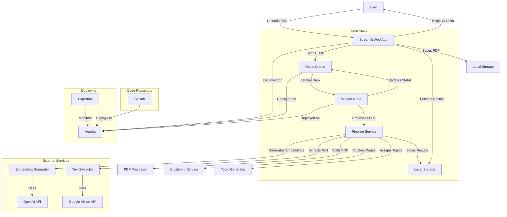
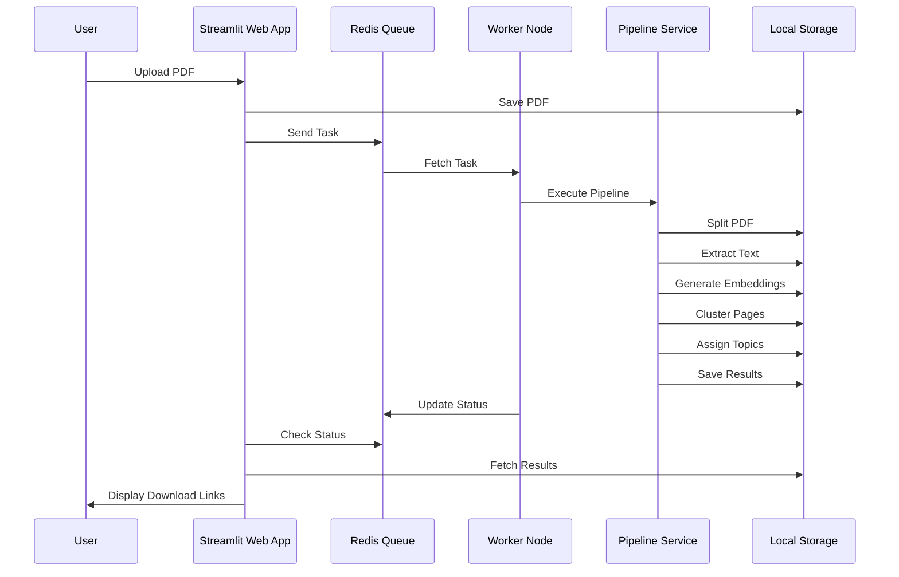
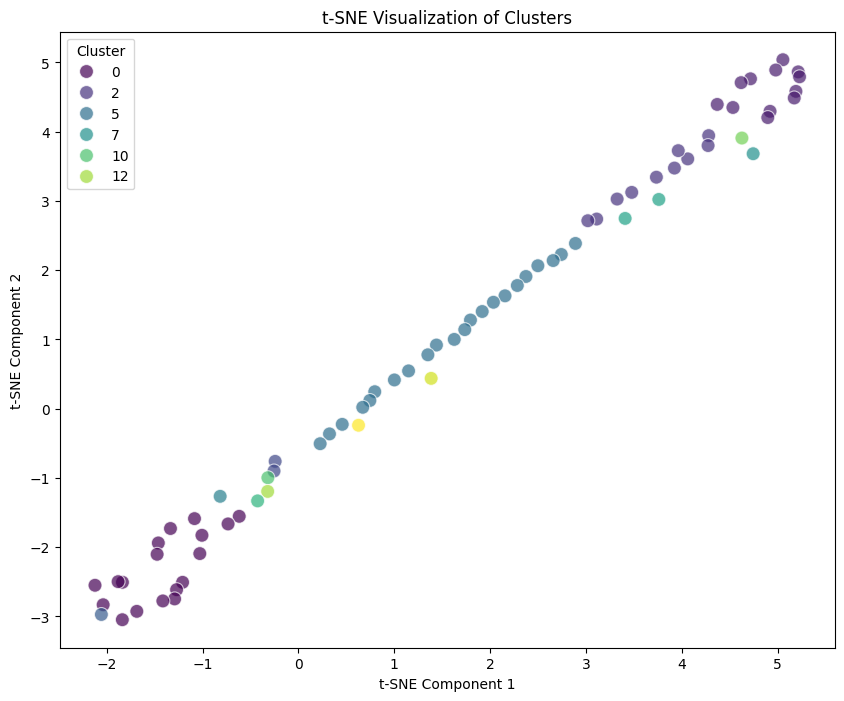
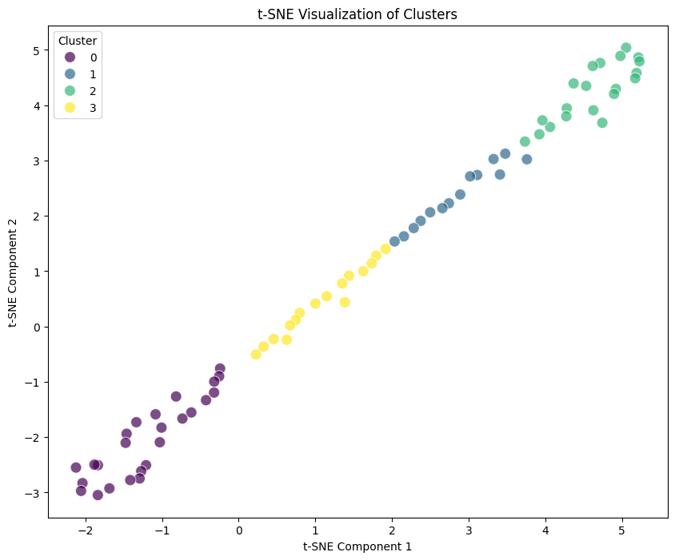

# AI-Powered PDF Document Splitter

This project implements an intelligent PDF document splitter that automatically separates a multi-document PDF into individual files. It uses text analysis, embeddings, and hierarchical clustering to identify document boundaries and group similar content.

## Features

- Extracts text from multi-document PDFs
- Generates embeddings for document content
- Uses hierarchical clustering to group similar documents
- Custom agglomerative clustering implementation that considers both embedding and page distances to ensure clusters of sequential page numbers (see [`clustering.py`](src/splitter/ml_models/clustering.py))
- Applies post-processing to ensure sequential page ranges within clusters
- Outputs individual PDF files for each identified document
- Streamlit UI for easy interaction

## Installation

1. Clone this repository:
    ```sh
    git clone https://github.com/zarifaziz/ai-pdf-document-splitter.git
    cd ai-pdf-document-splitter
    ```

2. Install dependencies using Poetry:
    ```sh
    poetry install
    ```

3. Copy the example environment file and set the env variables necessary:
    ```sh
    cp env.example .env
    ```

## Running the Application

To run the application, use the following steps:

1. Setup redis server
    ```
    brew install redis
    redis-server
    ```

2. Setup worker
    ```
    python -m src.web.worker
    ```

3. Setup Streamlit web app
    ```
    streamlit run src/web/app.py
    ```

When deployed on Heroku, it reads the following files in addition
- Procfile
- heroku_setup.sh
- runtime.txt

## Repository Structure

```
.
├── README.md
├── pyproject.toml
├── notebooks           # Jupyter notebooks for training and visualization.
├── src         
│  ├── splitter         # Core logic for processing PDFs.
│  │  ├── ml_models     
│  │  ├── processors
│  │  ├── pipeline.py
│  │  ├── settings.py  
│  │  ├── main.py 
│  │  └── domain_models.py
│  └── web 
│     ├── app.py        # App UI and send tasks into queue
│     └── worker.py     # executes pipeline on tasks from queue
├── Procfile            # heroku deployment code
├── bin/web
└── heroku_setup.sh
```

## High-Level Architecture

1. **Frontend**: 
   - Streamlit UI for user interaction.
   - Allows users to upload PDFs, view processing status, and download results.

2. **Backend**:
   - **Pipeline Service**:
     - **PDF Processor**: Splits PDFs into individual pages.
     - **Text Extractor**: Converts PDF pages to images and extracts text using OCR.
     - **Embedding Generator**: Generates embeddings from extracted text.
     - **Clustering Service**: Performs hierarchical clustering on embeddings.
     - **Topic Generator**: Assigns topics to document clusters.
   - **Message Queue**: Manages tasks and distributes them to worker nodes.
   - **Worker Nodes**: Process tasks asynchronously by calling pipeline and store results.

3. **Deployment**:
   - **Platform**: Deployed on Heroku for easy prototyping and MVP development.
   - **Message Queue**: Uses Redis Queue on Heroku for asynchronous processing.
   - **Database**: Locally stores intermediate and output files for MVP.
   - **Monitoring**: Papertrail for monitoring.

### Current Deployment Details

- The web node and worker nodes are currently running on the same server.
- We can easily decouple them by implementing a Cloud Storage solution for intermediate files.
- No dedicated API Gateway; the Streamlit app handles incoming requests and is deployed on Heroku.

### Flowchart



### Sequence Diagram




## Document Splitting Algorithm

The entire flow can be described as:
`Input PDF -> individual PDF pages -> Images -> Texts Files -> Embeddings -> Hierarchical clustering -> Individual Documents`

### 1. Document Chunking

The input to the system is a long PDF.

**Assumption**: An important assumption made in this project is that the input PDF is structured such that each document occupies a consecutive sequence of pages. Document boundaries are all between pages, never inside a particular page. We believe this is reasonable as these large PDFs are usually formed by merging individual documents in sequential order.

We use `pypdf` to **split the PDF by page**, enabling parallel processing and a scalable architecture. This is implemented in 
[`pdf_processor.py`](src/splitter/processors/pdf_processor.py).


### 2. Document Understanding

Part 1: Text Extraction.
Both of these processes are executed using parallel processing on the per-page splits of the PDF, as detailed in `text_extractor.py`.
- **Converting PDF pages to images**: We use `pdf2image` to convert the individual PDFs to images.
- **OCR to extract text from images**: We use Google Vision API to extract text from the images. This can also be achieved with `pytesseract OCR` locally, however, it was unable to work during deployment on Heroku so we switched to an out of the box solution.

Part 2: Batch embedding generation
- **Generating embeddings from text** Embeddings are generated from the extracted text using OpenAI's embedding model in "batch" mode as all the text files are converted in one request. This off-the-shelf model provides good general performance. 



As shown in the t-SNE visualization above, the embeddings for each manually labelled cluster aren't that distinct. There are lots of overlap in the clusters. This indicates that a better embedding model is required to improve the clustering quality. The quality of these embeddings were visualised using the [`notebooks/evaluate_clusters.ipynb`](notebooks/evaluate_clusters.ipynb) notebook.

Future improvements could involve building a custom embedding model or fine-tuning existing ones, as well as using vision transformers to embed the images as well as the text.

### 3. PDF Splitting / Document Clustering

The task is framed as an unsupervised clustering problem, using agglomerative clustering due to the unknown number of clusters.

This hierarchical clustering method is particularly advantageous for user experience, as it allows users to set their own `distance_thresholds` or granularity levels, thereby controlling the amount of splitting in the documents.

A custom distance function is used in the clustering process, which takes into account both the page distance and the embedding distance. This function is designed to favor sequential pages in each document, ensuring that pages that are close together and have similar content are more likely to be clustered together.

The custom distance function also includes an `alpha` parameter that allows for weighting between embedding distance and page distance. You can find the implementation of this custom distance function in the [`custom_distance`](src/splitter/ml_models/clustering.py#L8) function in `clustering.py`.

Parameters were optimized using grid search, with the training and visualization process documented in the [`notebooks/evaluate_clusters.ipynb`](notebooks/evaluate_clusters.ipynb) file.

#### Iteration Results

The table below summarizes the results of different iterations of our clustering algorithm. We used the Adjusted Rand Index (ARI) and Normalized Mutual Information (NMI) to evaluate the quality of the clusters. These metrics were calculated by manually labeling one set of documents to serve as a ground truth.

| Iteration | Alpha | Distance Threshold | Number of clusters | Adjusted Rand Index (ARI) | Normalized Mutual Information (NMI) |
| --- | --- | --- | --- | --- | --- |
| 1 | 0.9 | 1.5 | 6 | 0.451 | 0.686 |
| 2 | 0.85 | 2.0 | 6 | 0.500 | 0.700 |
| 3 | 0.9 | 2.1 | 4 | 0.630 | 0.689 |

**Preferred Iteration:** Iteration 2 was chosen for its balance between the number of clusters and performance metrics.

The result of Iteration 3 is visualized in the image below:




### 4. Generating Document Group Topics

To enhance customer experience and provide a better product perspective, we generate topic names for each split document. This allows users to easily identify and navigate to the specific document they are looking for based on the topic. 

Document Group Topic examples: "Affidavit", "Medical Documents", "Media Coverage".

We use OpenAI's GPT-4o-mini LLM, which is trained with "Next Token Prediction", for this task. This model is effective for topic generation based on context. Since generating a topic is a relatively simple task, we opted for a smaller, more cost-effective model.

The function responsible for assigning these topics to documents is `assign_topics_to_documents`, which can be found in [`document_processor.py`](src/splitter/processors/document_processor.py). This function uses the generated topics to label each document based on the specified strategy, such as using the text from the first page or a random sample of pages.

## Future Work

If I had unlimited time and resources, future improvements could include:

### Splitting Quality Improvements
- **Improving Embeddings**: Exploring multimodal embedding models to capture more information from the PDF pages 
- **Research Document Splitting Algorithms**: Explore more sophisticated document boundary detection and compare with clustering

### App improvements
- **Customer UI/UX**: Explore dendograph in the UI or some way for the user to visualise and understand the splitting process that's taking place. This would allow the user to use their domain knowledge to improve the split of the documents.
- **Enable Multi user App**: Authentication + Authorization + Session management in the app so that multiple users can use it

### Scale improvements
- **Data Persistence**: Store intermediate and output documents externally such as Amazon S3. This decreases memory requirements of workers and allows the web nodes and worker nodes to scale independently as they don't share any memory or files in the ephemeral file system of the server.
- **Horizontal Scaling for Worker Nodes**: Add a load balancer and auto-scaling to increase the number of worker nodes based on the number of tasks in the message queue. This will enable the app to handle high workloads by dynamically adjusting the processing capacity, ensuring timely task completion and efficient resource utilization.
- **Horizontal Scaling for Web Nodes**: Implement auto-scaling for web nodes to handle varying user traffic. By scaling the web nodes horizontally, the application can maintain high availability and responsiveness during peak usage times, providing a better user experience and reducing latency.
- **Cacheing**: Adding a cacheing layer for a user so that the same input PDF doesn't have to be reprocessed
- **Vector Database**: Storing embeddings in a vector database, managing a separate collection/index per user
